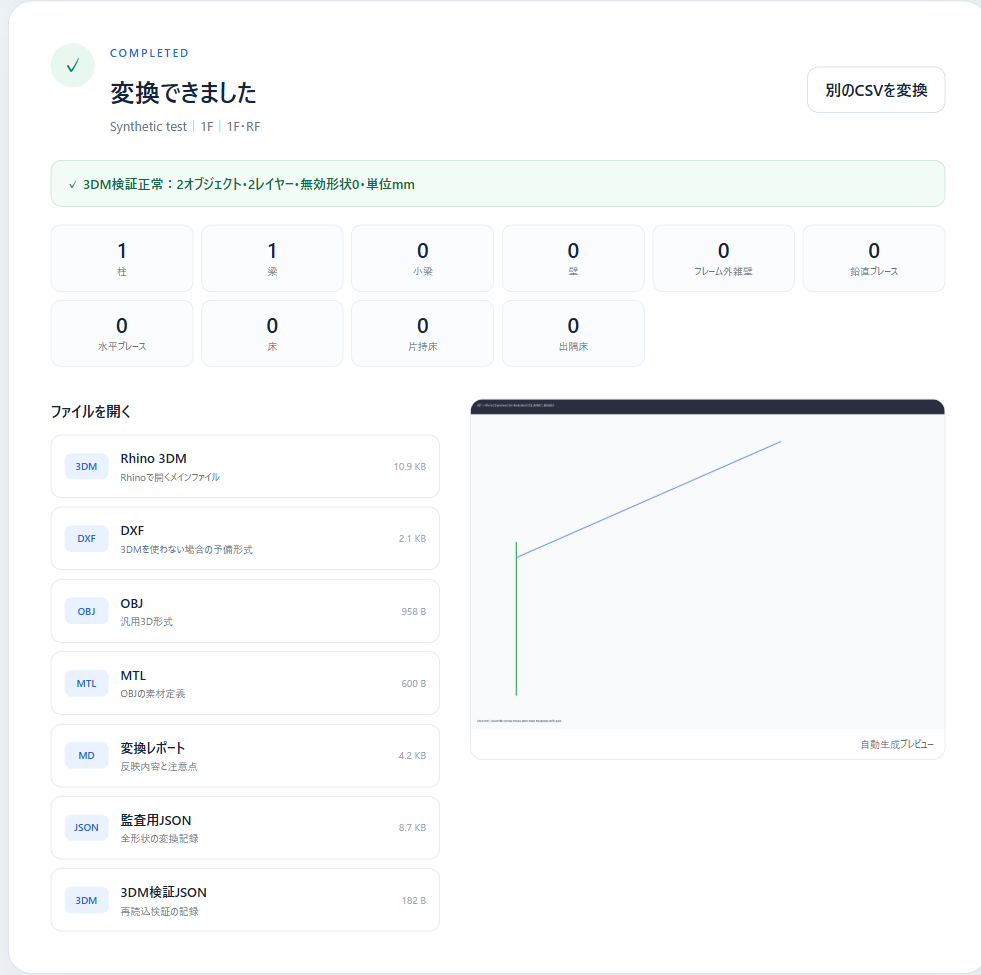

# SS7 Structure Modeler

[Webアプリを開く](https://rebuildon0.github.io/ss7-structure-modeler/) · [不具合・提案を報告する](https://github.com/rebuildon0/ss7-structure-modeler/issues)

SS7 の「CSV 出力（全項目）」を Rhino 用の形状モデルに変換する、非公式のブラウザツールです。インストールやアカウント登録なしで使えます。CSV の内容はブラウザ内で処理し、サイトのサーバーには送信しません。



> **検証状況:** 公開版では、合成CSVから柱1本・梁1本の3DMを生成し、ブラウザ内で再読込できることを確認しました。実案件のSS7 CSVとRhinoアプリ上での形状照合は未実施です。

## できること

- 柱・梁・小梁・壁・ブレース・床などを種類別レイヤーの3D形状に変換
- Rhinoで開ける3DMのほか、DXF・OBJをダウンロード
- 生成3DMの再読込結果、変換レポート、形状データを確認

## 使い方

1. SS7 で「CSV 出力（全項目）」を保存します。
2. [公開ページ](https://rebuildon0.github.io/ss7-structure-modeler/)で CSV を選び、「3Dモデルを作成」を押します。
3. 3DMをダウンロードしてRhinoで開き、原データと形状を照合します。変換レポートも確認してください。

手元にSS7のCSVがない場合は、[最小合成サンプル](examples/synthetic-ss7.csv)で画面の動作を試せます。このファイルは実案件データではありません。入力はUTF-8またはCP932のCSVに対応し、画面上の上限は100MBです。大きなCSVは端末のメモリを多く使います。

## ダウンロードできるファイル

| ファイル | 内容 |
| --- | --- |
| `*_rhino_model.3dm` | Rhino用3Dモデル（単位mm） |
| `*_rhino_model.dxf` | DXF形式のモデル |
| `*_rhino_model.obj` / `*.mtl` | 汎用3Dモデルと素材定義 |
| `*_conversion_report.md` | 反映内容、警告、仮断面、未展開項目 |
| `*_model_data.json` | 生成形状の監査用データ |
| `*_3dm_verify.json` | 3DM再読込時のオブジェクト数・レイヤー数・形状検証結果 |

プレビュー画像は結果画面に表示されます。3DMの再読込検証はファイルの読込と基本的な形状状態を確かめるもので、SS7入力との一致を保証するものではありません。

## 対応範囲と制限

このツールは**形状確認用モデル**を作ります。SS7へ戻す往復変換や、解析モデルとしての完全互換には対応しません。鋼材の一部は外形寸法による表示用形状です。入力によっては仮断面の適用や未展開項目があるため、必ず変換レポートを読み、業務利用前にRhino上で元のSS7データと照合してください。

## CSVと外部通信

CSVと生成ファイルはブラウザのメモリ内で処理します。CSVのアップロード処理はなく、元ファイルも変更しません。結果はブラウザから個別にダウンロードします。

ページと依存ライブラリの取得には通信が必要です。[Pyodide](https://pyodide.org/) v314.0.7（Pillowを含む）と [rhino3dm.js](https://github.com/mcneel/rhino3dm) v8.35.0をCDNから読み込みます。CDNにCSVの内容を送る処理はありません。初回は読み込みに時間がかかる場合があります。

## ローカルで試す・開発する

ビルドやパッケージのインストールは不要です。リポジトリのルートで静的HTTPサーバーを起動してください（Python 3がある場合の例）。

```sh
python -m http.server 8000
```

`http://localhost:8000/` を開き、`examples/synthetic-ss7.csv` を選びます。`file://` ではWorkerとモジュールの読み込みが動かないため、HTTPで開いてください。依存ライブラリの取得にはインターネット接続が必要です。

- `app.js`：画面、ファイル選択、結果のダウンロード
- `converter-worker.mjs`：Pyodideによる変換の実行、rhino3dm.jsによる3DM生成と再読込
- `convert_ss7_general.py`：SS7全項目CSVの解析、形状データ・DXF・OBJ・レポートの生成

## 開発への参加

不具合報告や改善提案は[Issues](https://github.com/rebuildon0/ss7-structure-modeler/issues)、変更提案はPull Requestでお願いします。再現用CSVを添える場合は合成データを使用し、実案件名や図面情報を含むCSVは公開しないでください。

## ライセンス

このリポジトリのコードと資料は[MIT License](LICENSE)で公開しています。CDNから取得する[Pyodide](https://github.com/pyodide/pyodide)や[rhino3dm](https://github.com/mcneel/rhino3dm)などの外部ライブラリには、それぞれのライセンスが適用されます。
